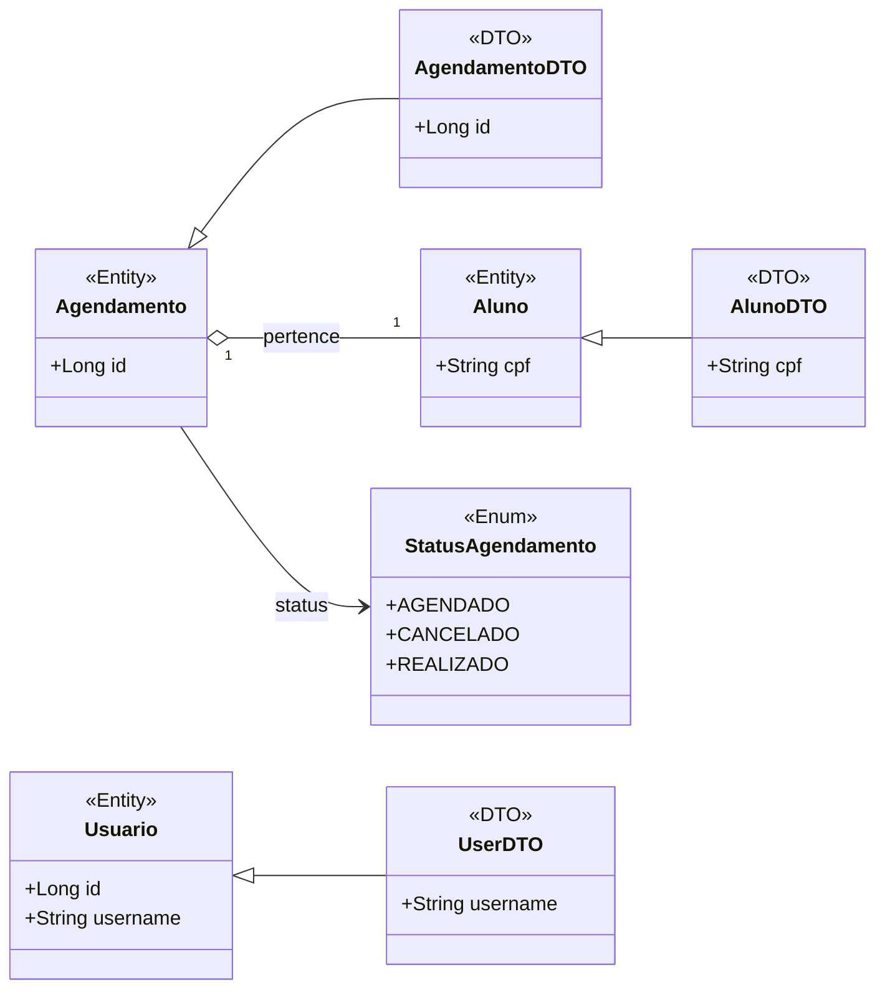
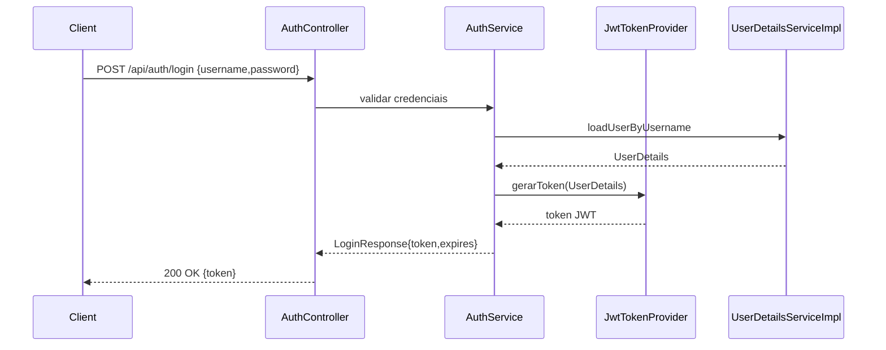
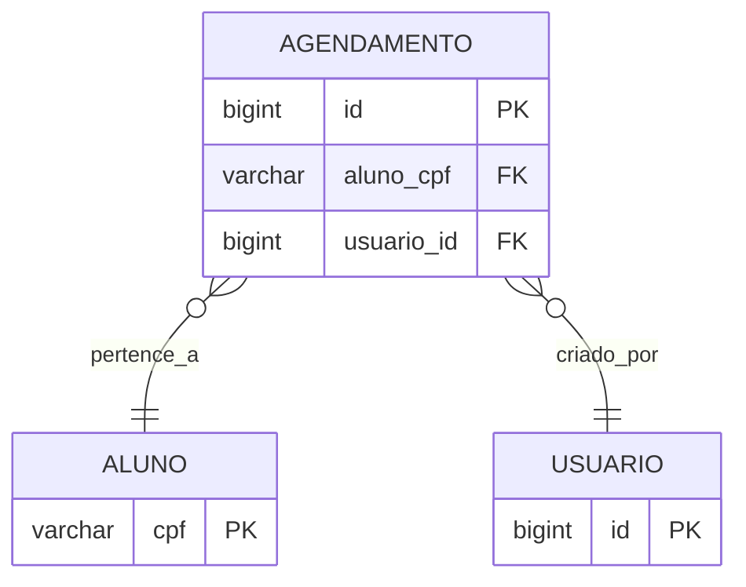

# Trainer API

Documentação técnica e operacional da API Trainer — backend RESTful desenvolvido com Java 17 e Spring Boot.

Sumário
- **Visão Geral**
- **Arquitetura**
- **Diagramas (Mermaid)**
- **API (endpoints, exemplos)**
- **Segurança (JWT)**
- **Qualidade & Manutenibilidade**
- **Execução local & Configuração**
- **Observabilidade & Logs**
- **Roadmap / Próximos passos**

Visão geral
------------
Trainer API é um serviço monolítico que expõe funcionalidades para gestão de alunos e agendamentos, com autenticação via JWT e documentação via OpenAPI/Swagger. O projeto está organizado segundo o padrão Controller → Service → Repository e usa PostgreSQL para persistência.

Arquitetura (resumo técnico)
----------------------------
Camadas
- **Controller** — Recebe e valida requests HTTP, mapeia para DTOs e devolve responses (pacote `controller`).
- **Service** — Regras de negócio, validações e orquestração de operações transacionais (pacote `service`).
- **Repository** — Interface com o banco de dados via Spring Data JPA (pacote `repository`).
- **Entity / DTO** — Entidades JPA persistidas (`entity`) e objetos de transferência (`dto`) para desacoplamento da API.

Justificativas técnicas
- Separação de camadas favorece testabilidade, manutenção e evolução independente da camada de persistência.
- Uso de DTOs evita vazamento de entidades JPA para o cliente e facilita versionamento de API.
- `Optional` em repositórios e `ResourceNotFoundException` centralizam tratamento de ausência de dados.
- Autenticação stateless com JWT reduz estado no servidor e simplifica escalabilidade horizontal.

Fluxo de requisição (exemplo)
1. `Controller` recebe HTTP request e converte para DTO.
2. `Controller` chama `Service` apropriado para executar a operação.
3. `Service` executa regras de negócio, valida entradas e interage com `Repository` para persistência.
4. `Repository` acessa o banco (JPA/Hibernate) e retorna entidades.
5. `Service` converte entidades para DTOs e retorna para o `Controller`.
6. `Controller` constrói a `ResponseEntity` HTTP com código apropriado.

Diagramas (Mermaid)
-------------------
1) Diagrama de classes (entidades principais e DTOs)



2) Diagrama de sequência: autenticação JWT (resumido)



3) MER (Modelo Entidade-Relacionamento) — resumo



API — Endpoints principais
--------------------------
Observação: não assumimos endpoints além dos presentes no projeto. Abaixo está a listagem consolidada com o comportamento observado nos controladores.

Auth
- POST /api/auth/login — Autentica usuário e retorna JWT. Public.
- POST /api/auth/register — Registra novo usuário (se implementado). Public.

Alunos (prefixo `/api/alunos`)
- GET /api/alunos — Listar todos os alunos. Requer autenticação.
- GET /api/alunos/{cpf} — Obter aluno por CPF. Requer autenticação.
- POST /api/alunos — Criar novo aluno. Requer autenticação.
- PUT /api/alunos/{cpf} — Atualizar aluno. Requer autenticação.
- DELETE /api/alunos/{cpf} — Deletar aluno. Requer autenticação.

Agendamentos
- POST /agendamentos — Criar agendamento. Requer autenticação.
- GET /agendamentos — Buscar agendamentos por período (query params: `start`, `end`). Requer autenticação.
- PUT /agendamentos/{id} — Atualizar agendamento. Requer autenticação.
- DELETE /agendamentos/{id} — Deletar agendamento. Requer autenticação.

Cabeçalho de autenticação
- Use header `Authorization: Bearer <token>` para endpoints protegidos.

Exemplos (JSON)

- Login (request)

```json
{
  "username": "admin",
  "password": "admin123"
}
```

- Login (response)

```json
{
  "token": "eyJhbGci...",
  "type": "Bearer",
  "expiresIn": 3600
}
```

- Criar Aluno (request) — exemplo mínimo

```json
{
  "cpf": "12345678900",
  "nome": "João Silva"
}
```

- Criar Agendamento (request) — exemplo mínimo

```json
{
  "alunoCpf": "12345678900",
  "data": "2026-01-15T10:30:00",
  "descricao": "Aula de avaliação"
}
```

Segurança — detalhes
---------------------
Fluxo de autenticação
1. Cliente envia credenciais para `POST /api/auth/login`.
2. `AuthController` delega validação ao `AuthService`.
3. `AuthService` usa `UserDetailsServiceImpl` para carregar dados do usuário e valida a senha (BCrypt).
4. Em caso de sucesso, `JwtTokenProvider` gera um token assinado e com tempo de expiração.
5. Cliente envia token em `Authorization: Bearer <token>` nas requisições subsequentes.

Papel e autorização
- O projeto mantém autenticação com usuários; permissões/roles podem existir no modelo `Usuario` se implementadas, mas a configuração atual trabalha com autenticação stateless e filtro JWT (`JwtAuthenticationFilter`).

Boas práticas adotadas
- Senhas armazenadas com BCrypt via `PasswordEncoder`.
- Tokens HMAC assinados; variável de configuração do segredo (`JWT_SECRET` / propriedade `jwt.secret`) deve ser mantida fora do código-fonte.
- Filtro JWT antes da cadeia de segurança para validar token e popular `SecurityContext`.

Qualidade e manutenibilidade
----------------------------
Padrões e princípios
- Arquitetura em camadas (Controller/Service/Repository).
- Uso de DTOs para desacoplamento da camada de persistência.
- Tratamento global de exceções via `GlobalExceptionHandler`.
- Uso de `Optional` e exceções de domínio (`ResourceNotFoundException`).
- Princípios SOLID aplicados: responsabilidades separadas (`S`), abstração via interfaces de repositório (`D`), serviços coesos (`O`, `L`, `I` aplicados na modelagem de DTOs/entidades).

Testes
- O projeto inclui dependências de testes (`spring-boot-starter-test`, `spring-security-test`). Mantenha testes unitários para `Service` e testes de integração para fluxos críticos (auth, CRUD).

Tratamento de erros
- `GlobalExceptionHandler` traduz exceções de domínio para respostas HTTP padronizadas (timestamp, status, error, message, path).

Execução local e configuração
----------------------------
Variáveis de ambiente e propriedades relevantes
- `spring.datasource.url` — URL JDBC do PostgreSQL (ex.: `jdbc:postgresql://localhost:5432/dbtrainer`).
- `spring.datasource.username` / `spring.datasource.password` — credenciais do banco.
- `jwt.secret` ou `JWT_SECRET` — segredo HMAC para assinatura de JWT.
- `server.port` — porta da aplicação (padrão usado: `8081`).
- `spring.profiles.active` — perfil Spring (`dev`, `test`, `prod`), caso queira ativar comportamentos por perfil.

Exemplos de execução

Modo desenvolvimento (com variável de ambiente JWT secret):

```bash
export JWT_SECRET="<valor_gerado>"
mvn -Djwt.secret="$JWT_SECRET" spring-boot:run
```

Build e execução do JAR:

```bash
mvn package -DskipTests
java -jar target/api-0.0.1-SNAPSHOT.jar --spring.profiles.active=prod
```

Configuração do banco (local):

```bash
# criar banco postgres local
createdb -U postgres dbtrainer
```

Observabilidade & Logs
----------------------
- O repositório contém a pasta `/logs` com arquivos de log (`api.log*`). Monitore esses arquivos para depuração e auditoria.
- Visualizar logs em tempo real:

```bash
tail -f logs/api.log
```

- Recomendação: configurar appenders (Logback/Log4j2) para rotação e nível por pacote em `application.properties`/`logback-spring.xml` conforme necessidade do ambiente.

Roadmap / Próximos passos (sugestões realistas)
--------------------------------------------
- API:
  - Implementar paginação e filtragem nos endpoints de listagem.
  - Versionamento de API (ex.: `/api/v1/...`).
- Segurança:
  - Implementar refresh token e revogação de tokens (se necessário).
  - Aplicar roles/autorizações mais granulares por endpoint.
- Observability:
  - Adicionar métricas (Micrometer) e exportar para Prometheus/Grafana.
  - Centralizar logs (ELK/EFK) em ambientes de produção.
- Qualidade:
  - Cobertura de testes automatizados (unit/integration).
  - Pipelines CI com análise estática (SpotBugs, PMD) e testes.

Referências rápidas
- Swagger UI: http://localhost:8081/swagger-ui.html
- OpenAPI: http://localhost:8081/api-docs
- Código-fonte: consulte o pacote `br.com.trainer.api` em `src/main/java`.

Contribuição & Onboarding
-------------------------
- Para iniciar localmente: configurar PostgreSQL, exportar `JWT_SECRET`, executar `mvn spring-boot:run`.
- Para novos desenvolvedores: foque em `service` para entender regras de negócio e `controller` para contratos de API; use `GlobalExceptionHandler` como referência de erros padronizados.